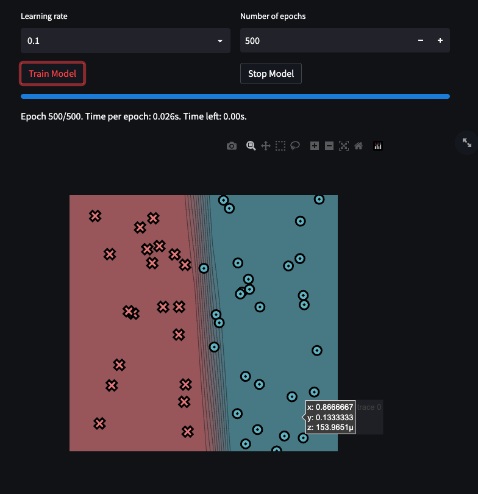
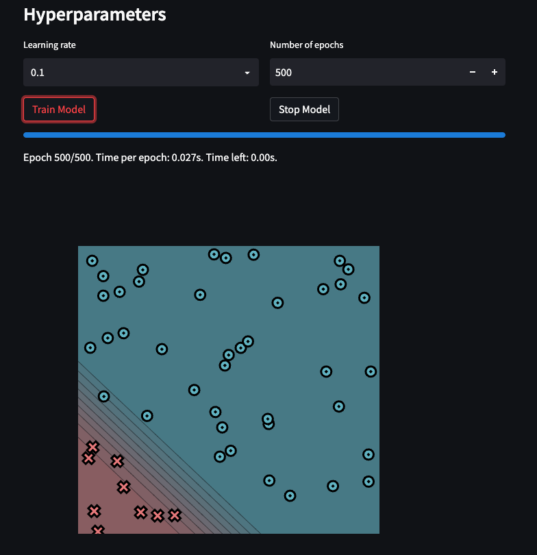
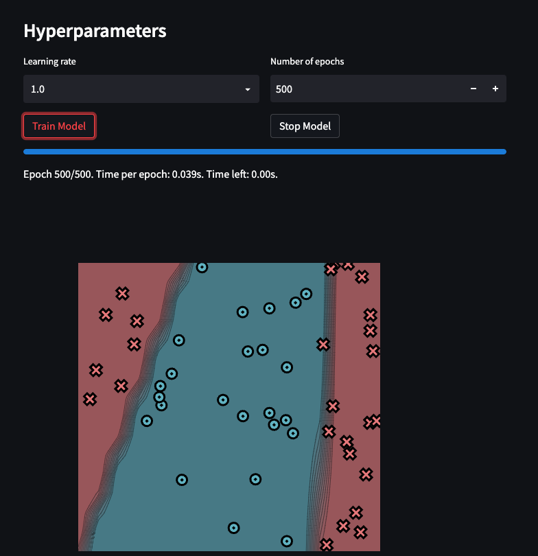
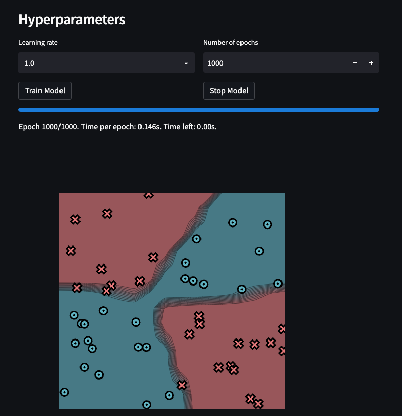

[](https://classroom.github.com/a/YFgwt0yY)
# MiniTorch Module 2


* Docs: https://minitorch.github.io/

* Overview: https://minitorch.github.io/module2/module2/

This assignment requires the following files from the previous assignments. You can get these by running

```bash
python sync_previous_module.py previous-module-dir current-module-dir
```

The files that will be synced are:

        minitorch/operators.py minitorch/module.py minitorch/autodiff.py minitorch/scalar.py minitorch/scalar_functions.py minitorch/module.py project/run_manual.py project/run_scalar.py project/datasets.py

### Simple


num of hidden layers: 2



Epoch: 0/500, loss: 0, correct: 0
Epoch: 0/500, loss: 0, correct: 0
Epoch: 10/500, loss: 28.50730022515543, correct: 35
Epoch: 20/500, loss: 27.43743058433895, correct: 32
Epoch: 30/500, loss: 26.462654851669146, correct: 34
Epoch: 40/500, loss: 25.335963365212077, correct: 36
Epoch: 50/500, loss: 24.03703144326474, correct: 39
Epoch: 60/500, loss: 22.564555114880168, correct: 42
Epoch: 70/500, loss: 20.942526422714316, correct: 43
Epoch: 80/500, loss: 19.281378886754556, correct: 44
Epoch: 90/500, loss: 17.70206327833884, correct: 44
Epoch: 100/500, loss: 16.262060905135808, correct: 46
Epoch: 110/500, loss: 14.909231881573337, correct: 47
Epoch: 120/500, loss: 13.869893630458309, correct: 47
Epoch: 130/500, loss: 13.047196229359441, correct: 47
Epoch: 140/500, loss: 12.316564064280676, correct: 47
Epoch: 150/500, loss: 11.658678653383294, correct: 47
Epoch: 160/500, loss: 11.047812788649466, correct: 47
Epoch: 170/500, loss: 10.46147629526962, correct: 47
Epoch: 180/500, loss: 9.917904185629743, correct: 49
Epoch: 190/500, loss: 9.400696076159427, correct: 49
Epoch: 200/500, loss: 8.90753477101038, correct: 50
Epoch: 210/500, loss: 8.439515388752517, correct: 50
Epoch: 220/500, loss: 7.997355967391336, correct: 50
Epoch: 230/500, loss: 7.584114881755313, correct: 50
Epoch: 240/500, loss: 7.202780589101604, correct: 50
Epoch: 250/500, loss: 6.848506932909824, correct: 50
Epoch: 260/500, loss: 6.518517780088856, correct: 50
Epoch: 270/500, loss: 6.215175232809665, correct: 50
Epoch: 280/500, loss: 5.94269912711166, correct: 50
Epoch: 290/500, loss: 5.688866668197668, correct: 50
Epoch: 300/500, loss: 5.452081490378527, correct: 50
Epoch: 310/500, loss: 5.23096768324809, correct: 50
Epoch: 320/500, loss: 5.024249625447053, correct: 50
Epoch: 330/500, loss: 4.830754237047348, correct: 50
Epoch: 340/500, loss: 4.649408647744457, correct: 50
Epoch: 350/500, loss: 4.47923502668894, correct: 50
Epoch: 360/500, loss: 4.319343884868452, correct: 50
Epoch: 370/500, loss: 4.168926763056224, correct: 50
Epoch: 380/500, loss: 4.027248893284947, correct: 50
Epoch: 390/500, loss: 3.8936421801934324, correct: 50
Epoch: 400/500, loss: 3.767498681938449, correct: 50
Epoch: 410/500, loss: 3.648264662959304, correct: 50
Epoch: 420/500, loss: 3.535435226439513, correct: 50
Epoch: 430/500, loss: 3.428549498962007, correct: 50
Epoch: 440/500, loss: 3.327186323036644, correct: 50
Epoch: 450/500, loss: 3.2309604074393725, correct: 50
Epoch: 460/500, loss: 3.1399591451649984, correct: 50
Epoch: 470/500, loss: 3.0534197593499686, correct: 50
Epoch: 480/500, loss: 2.970897853987029, correct: 50
Epoch: 490/500, loss: 2.8922989624100803, correct: 50
Epoch: 500/500, loss: 2.817169071389885, correct: 50

### Diag

Num of hidden layers: 2





Epoch: 0/500, loss: 0, correct: 0
Epoch: 10/500, loss: 24.65624609760107, correct: 41
Epoch: 20/500, loss: 24.298148297771803, correct: 41
Epoch: 30/500, loss: 24.05004940147324, correct: 41
Epoch: 40/500, loss: 23.853537900649485, correct: 41
Epoch: 50/500, loss: 23.684773521304216, correct: 41
Epoch: 60/500, loss: 23.532293164488514, correct: 41
Epoch: 70/500, loss: 23.389628505066167, correct: 41
Epoch: 80/500, loss: 23.252566727607945, correct: 41
Epoch: 90/500, loss: 23.118028109572492, correct: 41
Epoch: 100/500, loss: 22.98355667465517, correct: 41
Epoch: 110/500, loss: 22.847061865545996, correct: 41
Epoch: 120/500, loss: 22.70667120355108, correct: 41
Epoch: 130/500, loss: 22.56063600573007, correct: 41
Epoch: 140/500, loss: 22.407264320688487, correct: 41
Epoch: 150/500, loss: 22.244868455946484, correct: 41
Epoch: 160/500, loss: 22.07172020905061, correct: 41
Epoch: 170/500, loss: 21.886009550986905, correct: 41
Epoch: 180/500, loss: 21.685803789589077, correct: 41
Epoch: 190/500, loss: 21.46900489808847, correct: 41
Epoch: 200/500, loss: 21.2333030721022, correct: 41
Epoch: 210/500, loss: 20.97612487656486, correct: 41
Epoch: 220/500, loss: 20.694574735297856, correct: 41
Epoch: 230/500, loss: 20.385369221834925, correct: 41
Epoch: 240/500, loss: 20.044764977479407, correct: 41
Epoch: 250/500, loss: 19.668483684163483, correct: 41
Epoch: 260/500, loss: 19.251642294704396, correct: 41
Epoch: 270/500, loss: 18.78870514716464, correct: 41
Epoch: 280/500, loss: 18.273488792666843, correct: 41
Epoch: 290/500, loss: 17.69927291161619, correct: 41
Epoch: 300/500, loss: 17.059103276619084, correct: 41
Epoch: 310/500, loss: 16.34641216932752, correct: 41
Epoch: 320/500, loss: 15.556110768928033, correct: 41
Epoch: 330/500, loss: 14.686280404815665, correct: 41
Epoch: 340/500, loss: 13.74041930739952, correct: 41
Epoch: 350/500, loss: 12.78071868533161, correct: 41
Epoch: 360/500, loss: 11.963199247995707, correct: 43
Epoch: 370/500, loss: 11.204679737264533, correct: 43
Epoch: 380/500, loss: 10.441667764643602, correct: 43
Epoch: 390/500, loss: 9.684376335265345, correct: 45
Epoch: 400/500, loss: 9.014161009367848, correct: 47
Epoch: 410/500, loss: 8.423456685963904, correct: 47
Epoch: 420/500, loss: 7.923611362946728, correct: 48
Epoch: 430/500, loss: 7.470902864920507, correct: 48
Epoch: 440/500, loss: 7.0783233870416415, correct: 48
Epoch: 450/500, loss: 6.717126693319749, correct: 49
Epoch: 460/500, loss: 6.3807157232702405, correct: 50
Epoch: 470/500, loss: 6.08707384373088, correct: 50
Epoch: 480/500, loss: 5.822437246035627, correct: 50
Epoch: 490/500, loss: 5.578452255431549, correct: 50
Epoch: 500/500, loss: 5.348572958875752, correct: 50

### Split


Num of Layers: 3





Epoch: 0/500, loss: 0, correct: 0
Epoch: 10/500, loss: 34.62268832750514, correct: 26
Epoch: 20/500, loss: 34.61379876038329, correct: 26
Epoch: 30/500, loss: 34.612067930220356, correct: 26
Epoch: 40/500, loss: 34.609979648373255, correct: 26
Epoch: 50/500, loss: 34.60734909396122, correct: 26
Epoch: 60/500, loss: 34.60396944370652, correct: 26
Epoch: 70/500, loss: 34.591590409661954, correct: 26
Epoch: 80/500, loss: 34.55044753783391, correct: 26
Epoch: 90/500, loss: 34.482669927612015, correct: 26
Epoch: 100/500, loss: 34.35524145504313, correct: 26
Epoch: 110/500, loss: 34.07860647042571, correct: 26
Epoch: 120/500, loss: 32.99745173598443, correct: 36
Epoch: 130/500, loss: 30.514456694857962, correct: 35
Epoch: 140/500, loss: 27.010166512119735, correct: 37
Epoch: 150/500, loss: 25.16698001672746, correct: 37
Epoch: 160/500, loss: 27.838203992858052, correct: 28
Epoch: 170/500, loss: 31.848129817768736, correct: 31
Epoch: 180/500, loss: 23.865926690980768, correct: 40
Epoch: 190/500, loss: 19.574252944698568, correct: 43
Epoch: 200/500, loss: 20.685621140214003, correct: 39
Epoch: 210/500, loss: 29.46067580281348, correct: 34
Epoch: 220/500, loss: 24.13813068710645, correct: 40
Epoch: 230/500, loss: 24.244150034910085, correct: 40
Epoch: 240/500, loss: 21.949687077953158, correct: 40
Epoch: 250/500, loss: 32.77927950666651, correct: 33
Epoch: 260/500, loss: 15.456449767898246, correct: 43
Epoch: 270/500, loss: 9.198809019672229, correct: 47
Epoch: 280/500, loss: 21.026674297248775, correct: 41
Epoch: 290/500, loss: 5.9026637404169024, correct: 48
Epoch: 300/500, loss: 3.1430408764556037, correct: 50
Epoch: 310/500, loss: 2.281810750793749, correct: 50
Epoch: 320/500, loss: 1.7147054633974426, correct: 50
Epoch: 330/500, loss: 1.388567811076139, correct: 50
Epoch: 340/500, loss: 1.198212300314794, correct: 50
Epoch: 350/500, loss: 1.0498799043437015, correct: 50
Epoch: 360/500, loss: 0.937613330435073, correct: 50
Epoch: 370/500, loss: 0.845636106303734, correct: 50
Epoch: 380/500, loss: 0.7697655433519625, correct: 50
Epoch: 390/500, loss: 0.7048805478083345, correct: 50
Epoch: 400/500, loss: 0.6499959800729161, correct: 50
Epoch: 410/500, loss: 0.602732573884178, correct: 50
Epoch: 420/500, loss: 0.5616758983729268, correct: 50
Epoch: 430/500, loss: 0.5260120250571437, correct: 50
Epoch: 440/500, loss: 0.49345883829327125, correct: 50
Epoch: 450/500, loss: 0.46494132293647955, correct: 50
Epoch: 460/500, loss: 0.43930614757579217, correct: 50
Epoch: 470/500, loss: 0.41665595159807167, correct: 50
Epoch: 480/500, loss: 0.39615319071261285, correct: 50
Epoch: 490/500, loss: 0.3773960058667256, correct: 50
Epoch: 500/500, loss: 0.35993549410728826, correct: 50

### Xor

Num of Hidden Layers: 8





poch: 0/500, loss: 0, correct: 0
Epoch: 0/775, loss: 0, correct: 0
Epoch: 0/1000, loss: 0, correct: 0
Epoch: 10/1000, loss: 29.615384672541737, correct: 33
Epoch: 20/1000, loss: 27.7871003397441, correct: 34
Epoch: 30/1000, loss: 27.90022253490052, correct: 31
Epoch: 40/1000, loss: 16.045786513736495, correct: 48
Epoch: 50/1000, loss: 15.640555828496053, correct: 49
Epoch: 60/1000, loss: 32.439720460204356, correct: 28
Epoch: 70/1000, loss: 14.627019070650524, correct: 46
Epoch: 80/1000, loss: 24.178511726823462, correct: 37
Epoch: 90/1000, loss: 18.312270626307242, correct: 43
Epoch: 100/1000, loss: 12.466434433432637, correct: 47
Epoch: 110/1000, loss: 11.299037639642473, correct: 47
Epoch: 120/1000, loss: 11.1408485017001, correct: 48
Epoch: 130/1000, loss: 25.364457570892117, correct: 40
Epoch: 140/1000, loss: 17.35882866582835, correct: 41
Epoch: 150/1000, loss: 28.33466345128628, correct: 40
Epoch: 160/1000, loss: 9.484177169369337, correct: 45
Epoch: 170/1000, loss: 9.030660146643369, correct: 47
Epoch: 180/1000, loss: 8.035681126068479, correct: 47
Epoch: 190/1000, loss: 7.045034576175965, correct: 47
Epoch: 200/1000, loss: 45.265517897313444, correct: 37
Epoch: 210/1000, loss: 7.179098254603579, correct: 47
Epoch: 220/1000, loss: 6.091419707036403, correct: 48
Epoch: 230/1000, loss: 6.669216333758497, correct: 49
Epoch: 240/1000, loss: 11.55890673848618, correct: 44
Epoch: 250/1000, loss: 4.587206282099379, correct: 48
Epoch: 260/1000, loss: 6.385065036228888, correct: 49
Epoch: 270/1000, loss: 3.9398377306451002, correct: 49
Epoch: 280/1000, loss: 12.017677762738401, correct: 45
Epoch: 290/1000, loss: 3.186486141649251, correct: 49
Epoch: 300/1000, loss: 13.937442263900245, correct: 43
Epoch: 310/1000, loss: 2.882444080765819, correct: 50
Epoch: 320/1000, loss: 2.642069331399764, correct: 49
Epoch: 330/1000, loss: 5.9142370106541495, correct: 47
Epoch: 340/1000, loss: 1.7648300595775088, correct: 50
Epoch: 350/1000, loss: 1.500800334089, correct: 50
Epoch: 360/1000, loss: 38.622675165028724, correct: 40
Epoch: 370/1000, loss: 2.620484815821107, correct: 50
Epoch: 380/1000, loss: 1.5235590777215622, correct: 50
Epoch: 390/1000, loss: 1.1161845470232732, correct: 50
Epoch: 400/1000, loss: 0.8862295680798127, correct: 50
Epoch: 410/1000, loss: 0.7317199313579135, correct: 50
Epoch: 420/1000, loss: 0.6199447091650663, correct: 50
Epoch: 430/1000, loss: 0.535439475072091, correct: 50
Epoch: 440/1000, loss: 0.4695682416688891, correct: 50
Epoch: 450/1000, loss: 0.4170796631412459, correct: 50
Epoch: 460/1000, loss: 0.3743077602033217, correct: 50
Epoch: 470/1000, loss: 0.3388133672814188, correct: 50
Epoch: 480/1000, loss: 0.30943335902993285, correct: 50
Epoch: 490/1000, loss: 0.2844507234223929, correct: 50
Epoch: 500/1000, loss: 0.26288706946317075, correct: 50
Epoch: 510/1000, loss: 0.24415980135382875, correct: 50
Epoch: 520/1000, loss: 0.2277058215293692, correct: 50
Epoch: 530/1000, loss: 0.2131636306272932, correct: 50
Epoch: 540/1000, loss: 0.20025206603638604, correct: 50
Epoch: 550/1000, loss: 0.1887268691710204, correct: 50
Epoch: 560/1000, loss: 0.17850782812628396, correct: 50
Epoch: 570/1000, loss: 0.16939404098776206, correct: 50
Epoch: 580/1000, loss: 0.1611284671832542, correct: 50
Epoch: 590/1000, loss: 0.15359170150299822, correct: 50
Epoch: 600/1000, loss: 0.14669214862620925, correct: 50
Epoch: 610/1000, loss: 0.14035279551837102, correct: 50
Epoch: 620/1000, loss: 0.13450352511036134, correct: 50
Epoch: 630/1000, loss: 0.12908634787949877, correct: 50
Epoch: 640/1000, loss: 0.12406434337621693, correct: 50
Epoch: 650/1000, loss: 0.11939573482107192, correct: 50
Epoch: 660/1000, loss: 0.1150449157549512, correct: 50
Epoch: 670/1000, loss: 0.1109789925707498, correct: 50
Epoch: 680/1000, loss: 0.10717240869774305, correct: 50
Epoch: 690/1000, loss: 0.10360181773319838, correct: 50
Epoch: 700/1000, loss: 0.1002462645160293, correct: 50
Epoch: 710/1000, loss: 0.09708689527386039, correct: 50
Epoch: 720/1000, loss: 0.09410762036348341, correct: 50
Epoch: 730/1000, loss: 0.09129360737293593, correct: 50
Epoch: 740/1000, loss: 0.088632888879772, correct: 50
Epoch: 750/1000, loss: 0.08611210236372879, correct: 50
Epoch: 760/1000, loss: 0.08372075935762377, correct: 50
Epoch: 770/1000, loss: 0.08144913738604012, correct: 50
Epoch: 780/1000, loss: 0.07928866024758487, correct: 50
Epoch: 790/1000, loss: 0.07723079391883758, correct: 50
Epoch: 800/1000, loss: 0.07526900710367254, correct: 50
Epoch: 810/1000, loss: 0.07339706190113125, correct: 50
Epoch: 820/1000, loss: 0.07160900250930596, correct: 50
Epoch: 830/1000, loss: 0.06989946547323518, correct: 50
Epoch: 840/1000, loss: 0.06826346257413281, correct: 50
Epoch: 850/1000, loss: 0.06669635859607312, correct: 50
Epoch: 860/1000, loss: 0.06519412175881388, correct: 50
Epoch: 870/1000, loss: 0.06375282465313738, correct: 50
Epoch: 880/1000, loss: 0.0623689033986957, correct: 50
Epoch: 890/1000, loss: 0.061039335847969806, correct: 50
Epoch: 900/1000, loss: 0.05976090196891053, correct: 50
Epoch: 910/1000, loss: 0.058530645791572064, correct: 50
Epoch: 920/1000, loss: 0.0573459595522384, correct: 50
Epoch: 930/1000, loss: 0.05620441652142834, correct: 50
Epoch: 940/1000, loss: 0.05510379781753014, correct: 50
Epoch: 950/1000, loss: 0.05404191556941074, correct: 50
Epoch: 960/1000, loss: 0.053016843696035, correct: 50
Epoch: 970/1000, loss: 0.052026749952767175, correct: 50
Epoch: 980/1000, loss: 0.051069919346048785, correct: 50
Epoch: 990/1000, loss: 0.05014474587410687, correct: 50
Epoch: 1000/1000, loss: 0.04924965702560892, correct: 50